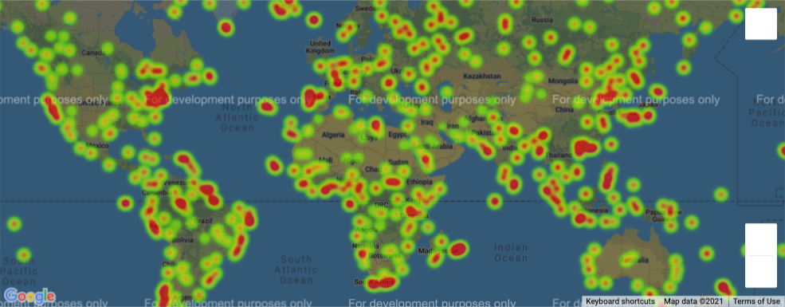
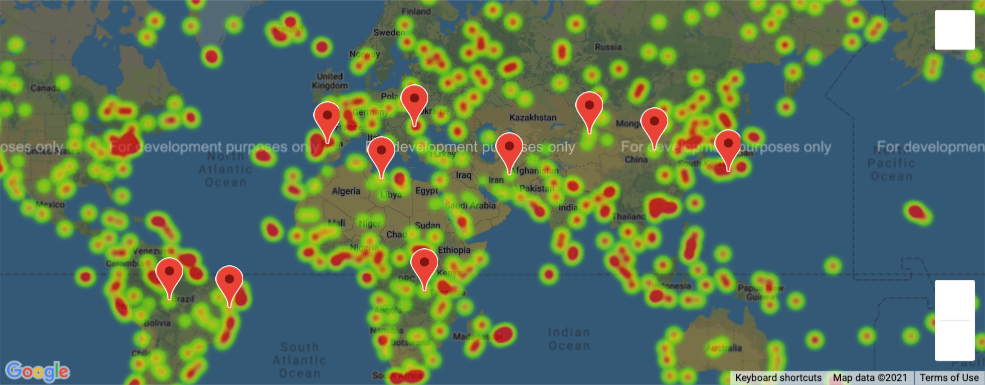

# python-api-challenge

## Part 1
### Observable Trends:
1. As you go towards the equator the max temperature in cities begin to go up while as you go away from the equator in either direction the max temperature gradually goes down. i did find it interesting that in the northern hemisphere, cities withing 20 latitude degrees of the equator had similar max temperatures than cities between 20 and 40 degrees in latitude, and in some cases even higher temperatures. Although, the observation i noticed about the northern hemisphere was not shown in the southern hemisphere graph but the outliers were flipped when comparing both graphs, where the northern hemisphere had outliers with high temperatures but the southern hemisphere had outliers with low temperatures.

2. Suprisingly to me, there is little to no correlation between the percentage of hummidity and the latitude of a city. this means the percentage of humidity in a city has nothing to do with the location it has on the latitude of the globe alone. the same can be said about the precentage of clouds in a city compared to its latitude.

3. I noticed that the mean Latitude of my randomly generated cities was 20.7 degrees and while looking at the graphs I can see a reason for this average. the reason I see is that there is a larger number of cities that reside in the northern hemisphere. this disparity in city locations could skew our findings to not give us an accurate comparrison between the two hemispheres.

## Part 2
### City Weather Heatmap

### Hotel Location Over Heatmap

